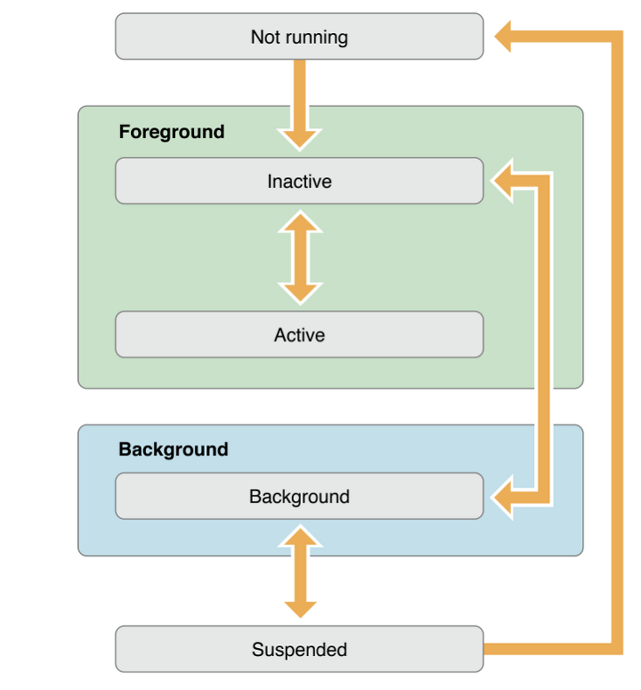
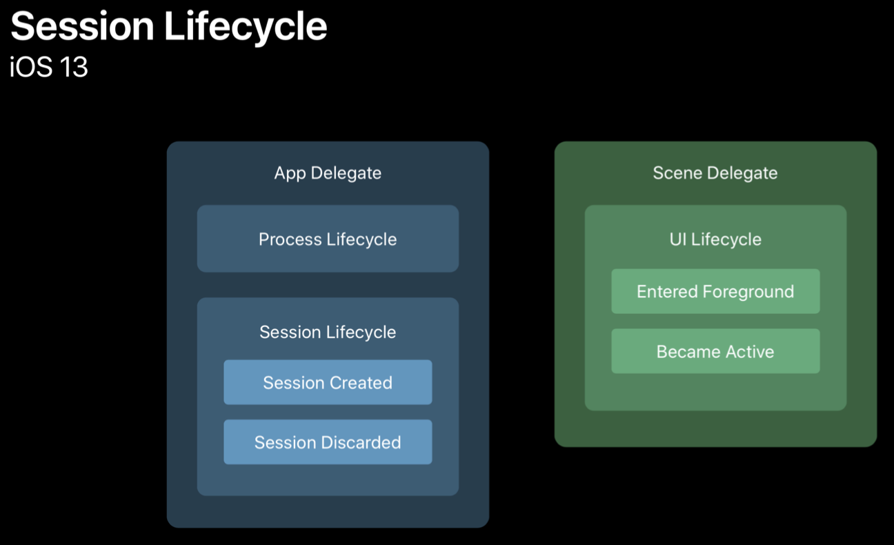
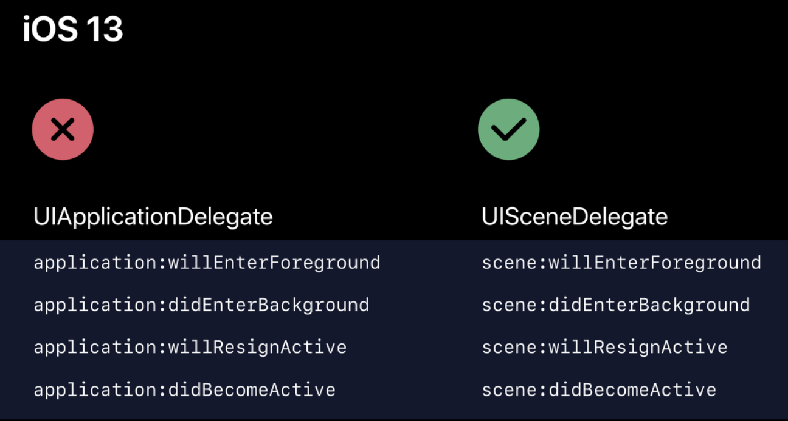
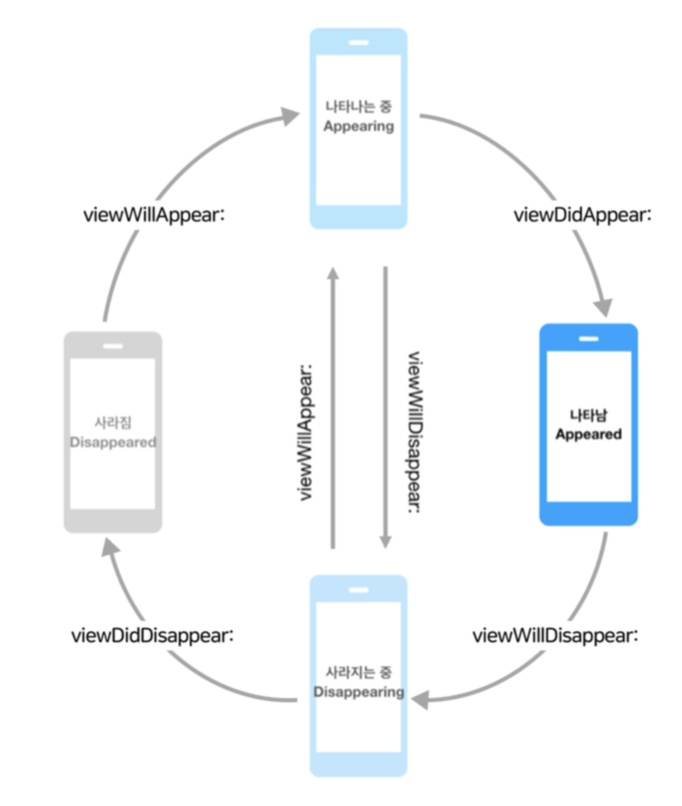

# 1주차 세미나

💾 [실습 프로젝트](https://github.com/27thONSOPT-iOS/JeongChoYi/tree/master/week-1/project-file)

앞부분은 개인적으로 공부할 때 알아보기 

### iOS app lifecycle

5가지 단계

*  Not running

  * 앱이 실행되지 않거나 종료된 상태

* Inactive

  * 앱이 전면에서 실행 중이지만, 아무런 이벤트를 안 받고 있는 상태

* Active

  * 앱이 전면에서 실행 중이며 이벤트를 받고 있는 상태

* Background

  * 앱이 백그라운드에 있지만 여전히 코드가 실행되고 있는 상태
  * 파일 다운로드, 업로드, 연산처리 ...

* Suspended 

  * 앱이 보이지 않고 실행되는 코드도 없는 상태

  

### AppDelegate.swift





* appDelegate methods -> SceneDelegate가 생겨서 조금 바뀜
  * 한가지 화면에 여러가지 화면 공존


### View lifecycle

화면이 사라지거나 나타나는 두가지 단계

View 관리 - ViewController

**View의 상태 변화 감지 메서드**

* viewWillAppear
  - 뷰가 계층에 추가되고 화면이 표시되기 직전에 호출되는 메서드
  - 화면이 나타날때마다 수행해야 하는 작업을 하기 좋은 시점
* viewDidAppear
  * 뷰가 계층에 추가되어 화면이 표시되면 호출되는 메서드
  * 뷰를 나타내는 것과 관련된 추가적인 작업을 하기 좋은 시점

- viewWillDisappear
  -  뷰가 계층에서 사라지기 직전에 호출되는 메서드
  - 뷰가 생성된 뒤 발생한 변화를 이전 상태로 되돌리기 좋은 시점

- viewDidDisappear

  - 뷰가 계층에서 사라진 후 호출되는 메서드
  - 시간이 오래 걸리는 작업은 하지 않는 것이 좋음

- viewDidLoad

  - 뷰 계층이 메모리에 로드된 직후 호출되는 메서드

  - 메모리에 처음 로딩될 때 1회 호출되는 메서드로, 

    메모리 경고로 뷰가 사라지지 않는 이상 다시 호출되지 않음


### Optional

* Int != Int?

* 정수형 변수랑 ==빼고는 수학연산 안 됨 nil일때는 대입도 안 됨

* 옵셔널바인딩 : if-let, if-var(이 변수는 if문 안에서만 사용 가능)

* guard-let, guard-var (guard문은 종료 명령문 써야 됨)
  * guard문이 if문에 비해 코드 블록 범위를 넓힐 수 있다
  * 예외사항 빠른 처리 원하면 guard문 사용

### Closure

* {} 코드 블럭
* 인자로 전달, 변수나 상수로 저장/전달, 함수에서 반환 가능

```swift
{ (Parameter) -> ReturnType in
 logic
}

//ex-1
func doSomething(number: Int?) -> Int {
  guard let unwrappedVar1 = number else {
    return -1
  }
  return unwrappedVar1
}

//ex-2
var optVar1: Int? = nil
var doSomething2 = { (number: Int?) -> Int in
	guard let unwrappedVar1 = number else {
    return -1
  }
  return unwrappedVar1
}
doSomething2(optVar1) // -1

//ex-3
var doSomething3: (Int?) -> Int
doSomething3 = doSomething2


```


