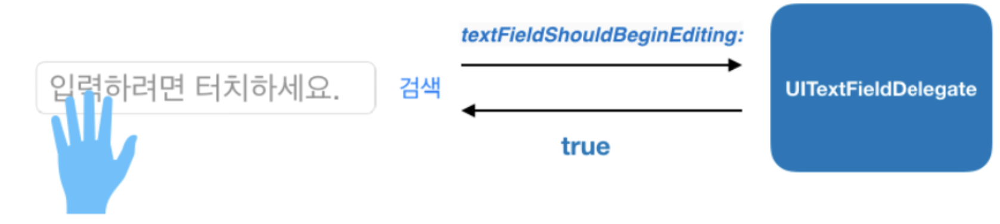

# 3주차 세미나

[💾 실습 프로젝트](https://github.com/27thONSOPT-iOS/JeongChoYi/tree/master/week-3/seminar)


### Protocol

> 특정한 작업이나 기능 부분적인 부분에 적합한 메소드, 프로퍼티, 요구사항들의 인터페이스

> 사용 : 프로토콜을 클래스, 구조체, 열거형에서 채택하여 해당 요구사항의 실제 구현 제공

> 프로토콜 : 해야할 일 정의, 프로토콜을 채택한 객체 : 구현

```swift
protocol Talkable { func talk() }

class Cat: Talkable { func talk() { ... }}
```


###  delegate pattern

> 객체지향 프로그래밍에서 하나의 객체가 모든 일을 처리하는 것이 아니라 처리해야하는 일 중 일부를 다른 객체에 넘기는 것

주로 프레임워크 객체가 위임 요청, 커스텀 컨트롤러 객체가 위임을 받아 특정 이벤트에 대한 기능을 구현

: 동일 동작에 대해 다양한 대응 가능



**[UITextFieldDelegate](https://developer.apple.com/documentation/uikit/uitextfielddelegate)** : 텍스트 필드 객체에서 처리할 수 있는 기능 중 일부를 커스텀 컨트롤러 객체에 위임하기 위해 모아놓은 메소드의 집합

```
textField.delegate = self //Textfield의 동작을 커스텀 뷰 컨트롤러에 위임
```

### extension

> 기존 클래스, 구조체 또는 열거형 타입에 새로운 기능을 추가할 수 있는 기능
>
> 기존 소스 코드에서 접근하지 못하는 타입들까지 확장 가능

```swift
extension DelegateVC: UITextFieldDelegate { // 커스텀 뷰 컨트롤러에서 위임받기 위해 프로토콜 채택
	// textFieldDidBeginEditing : 텍스트 필드를 터치하고 편집이 시작될 때 실행되는 메소드
	// textFieldDidEndEditing : 텍스트 필드의 편집을 끝낼 때 실행 되는 메소드
  // textFieldShouldEndEditing : 텍스트 필드의 편집을 끝낼 때 정말 편집을 끝낼건지 물어보는 메소드
	// textFieldShouldReturn : 텍스트 필드 편집 중 키보드에서 ‘return’키를 눌렀을 때 실행되는 메소드
	// textField.endEditing(true) : 텍스트 필드의 편집을 끝내주는 메소드
}
```

